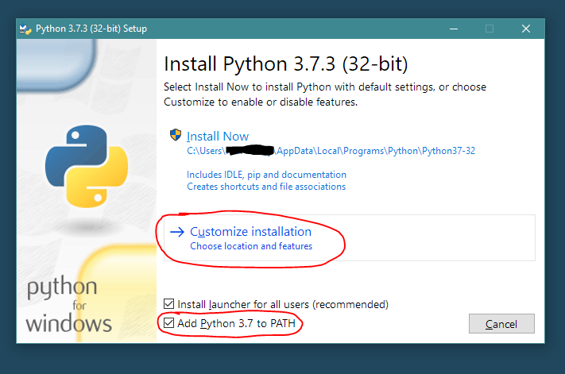
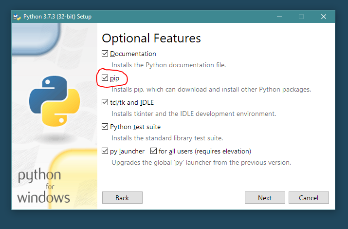
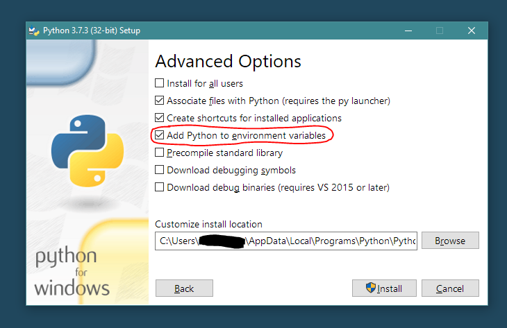
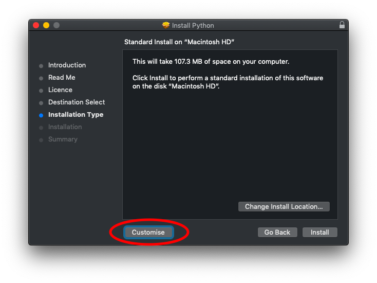
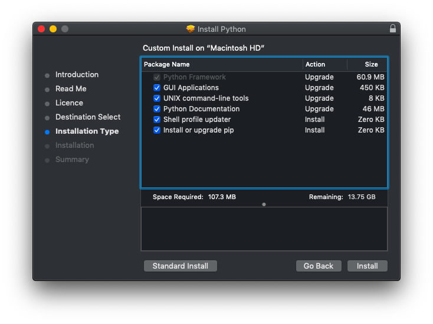

# Webdev prep

Hiya! To make this Friday's session go smoothly, do take note of the following instructions.

## Fork the template repository

Login to [GitHub](https://github.com/login), and fork this [template repository](https://github.com/kaine119/); we'll be working from this template, but you'll need your own fork to work on.

## Sign up for Heroku

[Heroku](https://heroku.com) is a Platform as a Service (PaaS), which serves as a deployment platform for all sorts of webapps. We'll be using Heroku to deploy our projects through the next few weeks. 

You can create an account [here](https://signup.heroku.com/).

## Try to bring your own laptop

For this Friday's session as well as the next few weeks, it'd be better for you to bring your own laptop, with your development environment set up. Don't worry if you can't; you'll still be able to follow along through GitHub's online editor.

**If you're bringing your laptop**, or **if you'd like to work on this at home**, there are a few things you'll need to install on your computer.

### Git

As introduced earlier, Git is a tool that helps you collaborate on projects. It's also an useful tool in the deployment cycle for Heroku, as we'll see next week. 

Install it from [here](https://git-scm.com/downloads), and verify it installed correctly by opening  Terminal (mac) or PowerShell (windows), and running

```
git --version
```

### Python

Like the past few sessions on Machine Learning, we'll be using Python to develop our web servers. Unlike the previous sessions, if you want to develop on your own computer, you'll need to install your own copy of Python.

Install it from [here](<https://www.python.org/downloads/>), and choose to **customize your installation**.

#### If you're using **Windows**:

* Check "**Add Python 3.7 to PATH**", then choose **Customise Installation**.
  

* Check "**pip**", under Optional Features *(more on this later)*
  

* Make sure "**Add Python to environment variables**" is selected, under Advanced Options
  
  

#### If you're using macOS:

* Choose "**Customise**" in the Installation Type step
  
* Make sure *everything* is checked; if you don't have enough space, you can choose not to install Python documentation, but it's better to do so.
  

These are usually set by default, but it doesn't hurt to check.

After the installation, open a Terminal/PowerShell, same as before, and verify that it installed correctly:

```sh
python --version
```

If your version starts with 3, you're all set!

**If this doesn't return something starting with Python 3.x**, try:

```sh
python3 --version
```

If this command works, use `python3` instead of `python`.

### flask, through `pip`

We'll be using a web framework called `flask` to write server-side code. It's distributed as a Python *module*, so you'll need to install it with Python's built-in package manager, `pip`, which should have been installed along with Python itself if you followed the above instructions. 

Verify that pip is installed correctly with

```sh
pip3 --version
```

To install Flask, run

```sh
pip3 install --user flask
```

### Test your environment out!

Now you've installed everything, it's time to test your dev environment out. This is a good time to get familiar with the command line, too.

Open PowerShell/Terminal, then `cd` to a convenient location, like your Desktop:

```sh
cd Desktop
```

Then clone your fork of the template repository:

```sh
git clone https://github.com/(your username)/webdev-1 
```

`cd` into your new folder, then have a look around with `ls`:

```sh
cd webdev-1
ls
```

Now execute `app.py` with:

```sh
python app.py
```

(again, replace `python` with `python3` if you need to.)

If you see an alert from your firewall about python3, allow the connection.

You should see the following:

```
$ python3 app.py
 * Serving Flask app "app" (lazy loading)
 * Environment: production
   WARNING: Do not use the development server in a production environment.
   Use a production WSGI server instead.
 * Debug mode: off
 * Running on http://127.0.0.1:5050/ (Press CTRL+C to quit)
```

Open your browser and type `localhost:5050` in the address bar. You should see:

```
Hello world!
```

If you've gotten here, congrats~ you're done!

